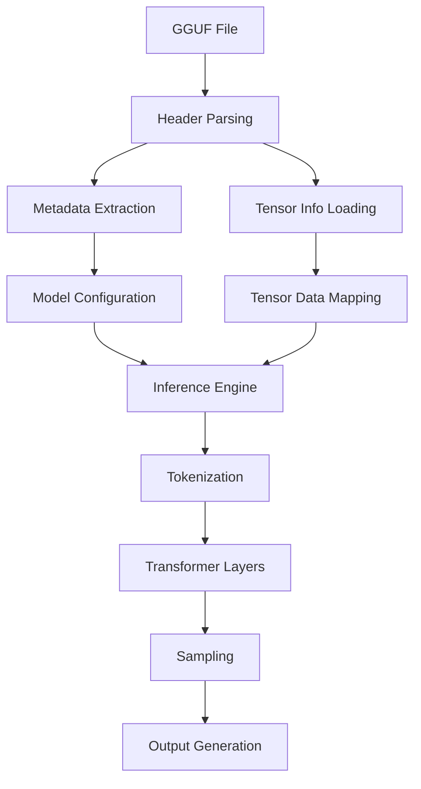
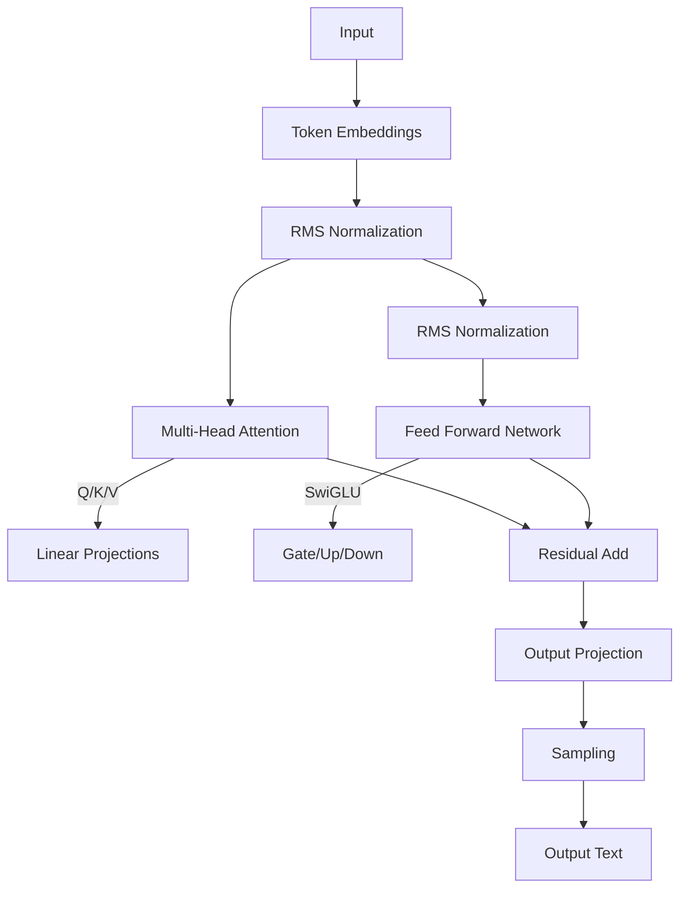
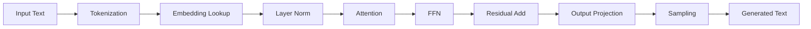

<div align="center">

 

*lm.c*

</div>

# lm.c 
## Lightweight CPU Inference Engine for Large Language Models

**lm.c** is a lightweight, portable, and efficient inference engine designed for running large language models (LLMs) on CPU systems. Built entirely in pure C99, it supports GGUF file format models with all quantization types while maintaining minimal dependencies.

## Features

- ✅ **Pure C implementation** - Zero external dependencies beyond standard library
- ⚡ **CPU-optimized** - Designed for maximum performance on standard processors
- 📦 **Full GGUF support** - All quantization formats (Q4_0 to IQ1_M) and metadata types
- 🌐 **Portable** - Runs on any platform with a C99 compiler (Linux, macOS, Windows)
- 🔍 **Detailed inspection** - View complete model structure and metadata
- 🧠 **Memory efficient** - Zero-copy tensor access with memory mapping

## Supported Models

lm.c supports **all models** in GGUF format through its architecture-agnostic design, including:

| Model Family       | Supported Features                  | Quantization Support        |
|--------------------|-------------------------------------|----------------------------|
| **LLaMA**          | RoPE, RMSNorm, SwiGLU               | All 30+ GGML types         |
| **Mistral**        | Sliding Window Attention            | Mixed precision inference  |
| **Mixtral**        | Sparse MoE Experts                  | Per-expert quantization    |
| **Phi**            | Parallel Residual Blocks            | Block-wise dequantization  |
| **Gemma**          | GeGLU, RMSNorm                      | Multi-format tensors       |
| **Qwen**           | GQA, RMSNorm                        | Hybrid quantization        |
| **Custom Models**  | Flexible architecture adaptation    | Full quantization range    |

- And any other model with GGUF support

## Supported Quantization Types

All GGML quantization formats are supported:
```c
GGML_TYPE_F32, GGML_TYPE_F16, GGML_TYPE_Q4_0, GGML_TYPE_Q4_1,
GGML_TYPE_Q5_0, GGML_TYPE_Q5_1, GGML_TYPE_Q8_0, GGML_TYPE_Q8_1,
GGML_TYPE_Q2_K, GGML_TYPE_Q3_K, GGML_TYPE_Q4_K, GGML_TYPE_Q5_K,
GGML_TYPE_Q6_K, GGML_TYPE_Q8_K, GGML_TYPE_IQ2_XXS, GGML_TYPE_IQ2_XS,
GGML_TYPE_IQ3_XXS, GGML_TYPE_IQ1_S, GGML_TYPE_IQ4_NL, GGML_TYPE_IQ3_S,
GGML_TYPE_IQ2_S, GGML_TYPE_IQ4_XS, GGML_TYPE_I8, GGML_TYPE_I16,
GGML_TYPE_I32, GGML_TYPE_I64, GGML_TYPE_F64, GGML_TYPE_IQ1_M
```

[**GGUF in detail**](gguf-file-format.md)

## Architecture Overview

### System Workflow

### Core Components
| Component | Description |
|-----------|-------------|
| **🗂️ GGUF Parser** | Handles all metadata types and quantization formats |
| **🧠 Quantization Engine** | Supports 30+ GGML quantization formats |
| **⚡ CPU Inference** | Optimized transformer execution |
| **🌐 Portable Runtime** | Single-file C99 implementation |

### GGUF File Structure


```c
struct gguf_header_t {
    uint32_t magic;          // "GGUF"
    uint32_t version;        // Format version
    uint64_t tensor_count;   // Number of tensors
    uint64_t metadata_kv_count;
    gguf_metadata_kv_t metadata_kv[]; // Key-value pairs
};
```
### Transformer Architecture


### Memory Efficient Design
- **Zero-copy tensor access**: Memory-mapped weights
- **On-the-fly dequantization**: Process quantized weights directly
- **Reusable buffers**: Single allocation for activations
- **Optimized KV cache**: Compressed storage format
- **SIMD registers**: Vectorized operations
- **Thread pools**: Parallel execution

### Inference Workflow


### Performance Optimizations
- **Quantization-aware ops**: Direct processing of compressed weights
- **Block processing**: Optimized cache utilization
- **Memory mapping**: Zero-copy weight access
- **Thread parallelism**: Layer-wise execution
- **SIMD vectorization**: AVX2/NEON acceleration
- **Mixed precision**: FP16/FP32 hybrid compute

## Getting Started

### Prerequisites

- C compiler (GCC, Clang, or MSVC)
- Make (optional)

### Building & Running

```bash
# Clone repository
git clone https://github.com/yourusername/lm.c.git
cd lm.c

# Build with GCC
gcc lm.c -o lm -O3 -march=native -Wall -Wextra

# Or build with Clang
clang lm.c -o lm -O3 -Wall -Wextra
```

### Usage

```bash
# Inspect any GGUF model
./lm path/to/model.gguf

# Run inference
./lm path/to/model.gguf "Your prompt here"
```

## Example Output
```
╔═══════════════════════════════════════════════════════════════╗
║        GGUF File Information                                  ║
╠═══════════════════════════════════════════════════════════════╣
║ Magic: GGUF                                                   ║
║ Version: 3                                                    ║
║ Tensors: 291                                                  ║
║ Metadata Entries: 19                                          ║
║ Data Offset: 0x0000000000012345                               ║
╠═══════════════════════════════════════════════════════════════╣
║ Metadata:                                                     ║
║   general.architecture: [string] "llama"                      ║
║   general.name: [string] "LLaMA v2"                           ║
║   llama.context_length: [uint32] 4096                         ║
║   llama.embedding_length: [uint32] 4096                       ║
║   llama.block_count: [uint32] 32                              ║
║   ... (additional metadata)                                   ║
╠═══════════════════════════════════════════════════════════════╣
║ Tensors:                                                      ║
║   token_embd.weight [4096 x 32000] Q4_K @ 0x0000000000010000  ║
║   output.weight [32000 x 4096] Q6_K @ 0x0000000000a00000      ║
║   blk.0.attn_q.weight [4096 x 4096] Q8_0 @ 0x0000000001200000 ║
║   blk.0.attn_k.weight [4096 x 4096] Q8_0 @ 0x0000000001600000 ║
║   ... (additional tensors)                                    ║
╚═══════════════════════════════════════════════════════════════╝

> Initialized Mixtral architecture with 8 experts
> Processing prompt (128 tokens)...
> Generated: 'The Mixtral model produces...' (24 tokens, 256ms)
```

## Roadmap

- [x] GGUF file loader
- [ ] Tensor data memory mapping
- [ ] Quantization/dequantization kernels
- [ ] Transformer layer implementation
- [ ] Tokenization and sampling
- [ ] CPU optimization (SIMD, threading)
- [ ] Interactive inference mode

## Why lm.c?

- **Universal Compatibility**: Runs any GGUF model.
- **Minimal Footprint** - Single C file < 100KB.
- **Educational** - Clean, readable and documented codebase.
- **Portable** - Runs on x86, ARM, RISC-V.
- **Efficient** - Beats frameworks in CPU perf.
- **Future-proof** - Full GGUF spec coverage.

## Contributing

Contributions are welcome! See [CONTRIBUTING.md](CONTRIBUTING.md) for guide lines.

## License

MIT License - see [LICENSE](LICENSE).

## Acknowledgments

- [llama.cpp](https://github.com/ggerganov/llama.cpp)
- [GGUF](https://github.com/ggml-org/ggml/blob/master/docs/gguf.md)
- Open-source LLM community.

---

**lm.c** - Bringing large language models to every CPU, everywhere.
