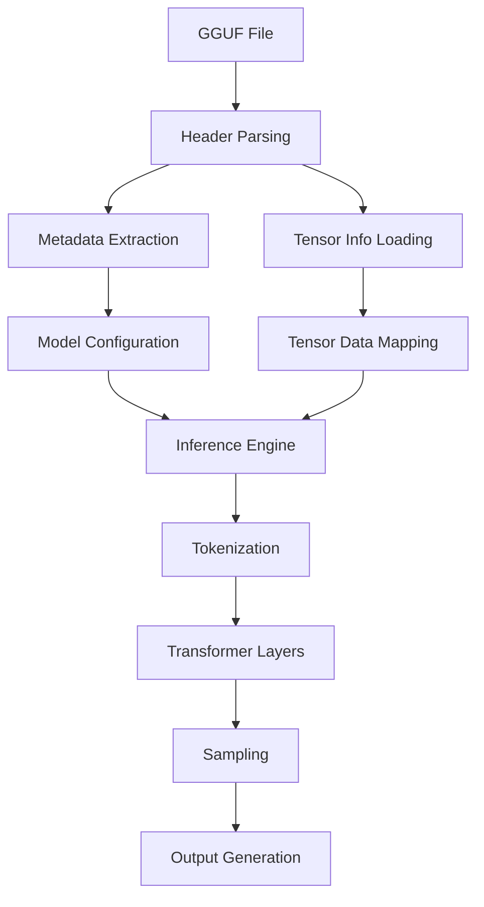

 *lm.c*

# lm.c - Lightweight CPU Inference Engine for Large Language Models

**lm.c** is a lightweight, portable, and efficient inference engine designed for running large language models (LLMs) on CPU systems. Built entirely in pure C99, it supports GGUF file format models with all quantization types while maintaining minimal dependencies.

## Features

- ✅ **Pure C implementation** - Zero external dependencies beyond standard library
- ⚡ **CPU-optimized** - Designed for maximum performance on standard processors
- 📦 **Full GGUF support** - All quantization formats (Q4_0 to IQ1_M) and metadata types
- 🌐 **Portable** - Runs on any platform with a C99 compiler (Linux, macOS, Windows)
- 🔍 **Detailed inspection** - View complete model structure and metadata
- 🧠 **Memory efficient** - Zero-copy tensor access with memory mapping

## Supported Models

lm.c supports all models in GGUF format, including:
- LLaMA (2, 3, CodeLlama)
- Mistral
- Phi-2
- Mixtral
- Gemma
- Qwen
- And any other model with GGUF support

## Supported Quantization Types

All GGML quantization formats are supported:
```c
GGML_TYPE_F32, GGML_TYPE_F16, GGML_TYPE_Q4_0, GGML_TYPE_Q4_1,
GGML_TYPE_Q5_0, GGML_TYPE_Q5_1, GGML_TYPE_Q8_0, GGML_TYPE_Q8_1,
GGML_TYPE_Q2_K, GGML_TYPE_Q3_K, GGML_TYPE_Q4_K, GGML_TYPE_Q5_K,
GGML_TYPE_Q6_K, GGML_TYPE_Q8_K, GGML_TYPE_IQ2_XXS, GGML_TYPE_IQ2_XS,
GGML_TYPE_IQ3_XXS, GGML_TYPE_IQ1_S, GGML_TYPE_IQ4_NL, GGML_TYPE_IQ3_S,
GGML_TYPE_IQ2_S, GGML_TYPE_IQ4_XS, GGML_TYPE_I8, GGML_TYPE_I16,
GGML_TYPE_I32, GGML_TYPE_I64, GGML_TYPE_F64, GGML_TYPE_IQ1_M
```

## Getting Started

### Prerequisites

- C compiler (GCC, Clang, or MSVC)
- Make (optional)

### Building

```bash
# Clone repository
git clone https://github.com/yourusername/lm.c.git
cd lm.c

# Build with GCC
gcc lm.c -o lm -O3 -Wall -Wextra

# Or build with Clang
clang lm.c -o lm -O3 -Wall -Wextra
```

### Usage

Inspect a GGUF model file:
```bash
./lm path/to/model.gguf
```

## Example Output

```
╔═════════════════════════════════════╗
║        GGUF File Information        ║
╠═════════════════════════════════════╣
║ Magic: GGUF                        ║
║ Version: 3                         ║
║ Tensors: 291                       ║
║ Metadata Entries: 19               ║
║ Data Offset: 0x0000000000012345    ║
╠═════════════════════════════════════╣
║ Metadata:
║   general.architecture: [string] "llama"
║   general.name: [string] "LLaMA v2"
║   llama.context_length: [uint32] 4096
║   llama.embedding_length: [uint32] 4096
║   llama.block_count: [uint32] 32
║   ... (additional metadata)
╠═════════════════════════════════════╣
║ Tensors:
║   token_embd.weight [4096 x 32000] Q4_K @ 0x0000000000010000
║   output.weight [32000 x 4096] Q6_K @ 0x0000000000a00000
║   blk.0.attn_q.weight [4096 x 4096] Q8_0 @ 0x0000000001200000
║   blk.0.attn_k.weight [4096 x 4096] Q8_0 @ 0x0000000001600000
║   ... (additional tensors)
╚═════════════════════════════════════╝
```

## Roadmap

- [x] GGUF file loader
- [ ] Tensor data memory mapping
- [ ] Quantization/dequantization kernels
- [ ] Transformer layer implementation
- [ ] Tokenization and sampling
- [ ] CPU optimization (SIMD, threading)
- [ ] Interactive inference mode

## Architecture Overview



## Why lm.c?

- **Minimal footprint** - Single C file implementation
- **Educational** - Clean, readable codebase for learning LLM internals
- **Portable** - Runs everywhere from servers to embedded devices
- **Efficient** - Optimized for CPU performance without GPU dependencies
- **Future-proof** - Full support for all GGUF quantization formats

## Contributing

Contributions are welcome! Please see our [Contribution Guidelines](CONTRIBUTING.md) for details.

## License

lm.c is released under the MIT License - see [LICENSE](LICENSE) for details.

## Acknowledgments

- Inspired by [llama.cpp](https://github.com/ggerganov/llama.cpp)
- GGUF specification by Georgi Gerganov
- All open-source LLM researchers and contributors

---

**lm.c** - Bringing large language models to every CPU, everywhere.
